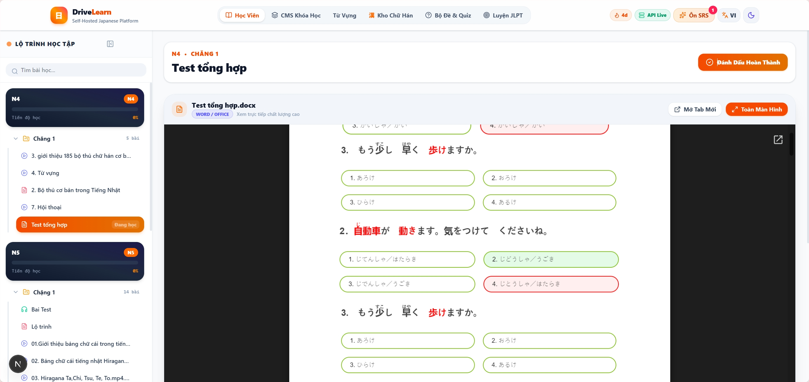
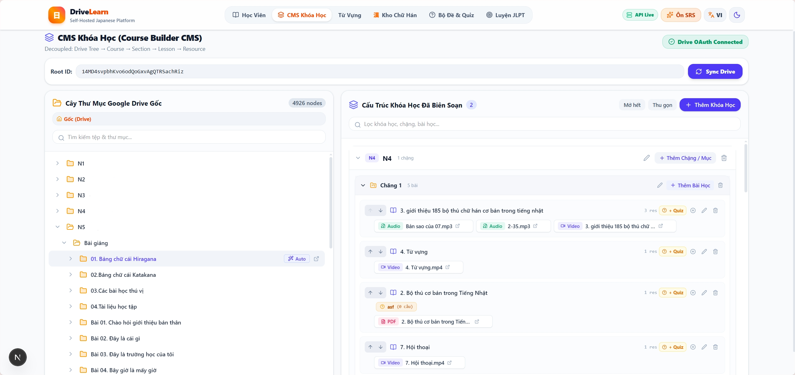
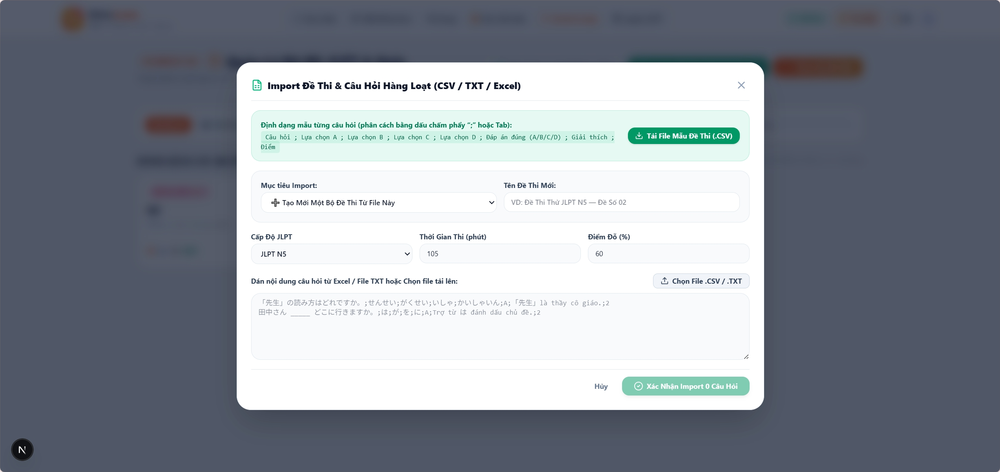
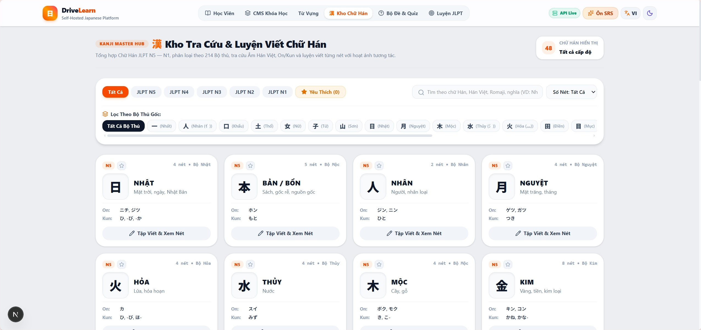
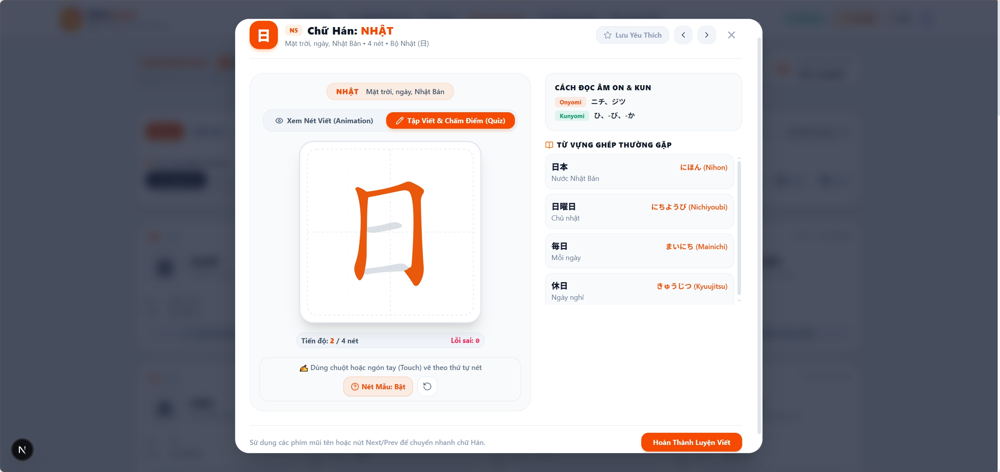
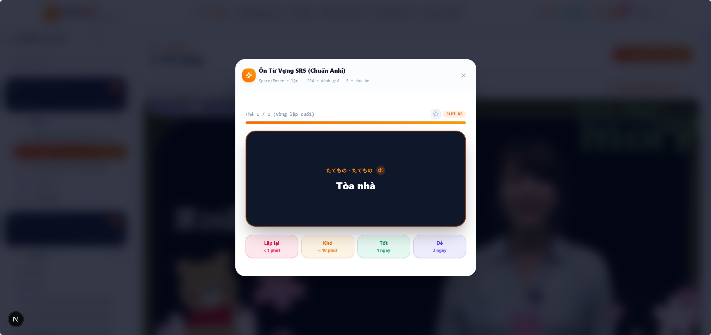
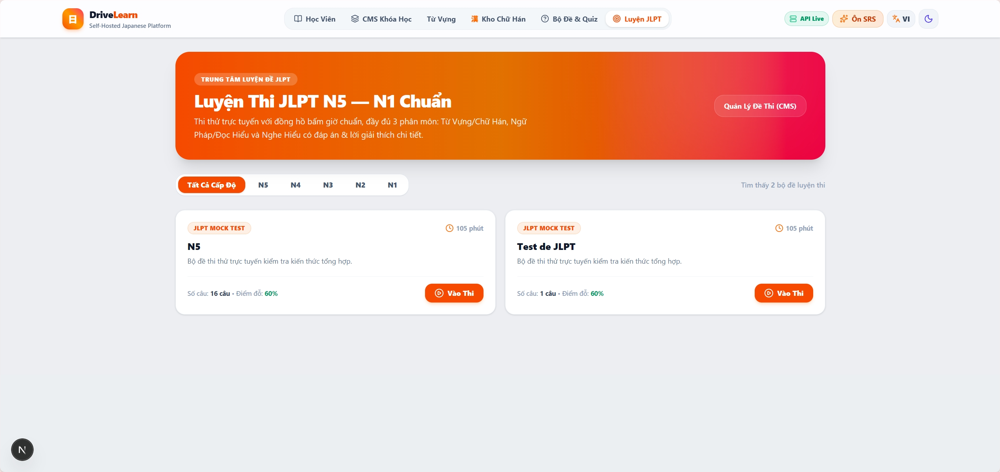
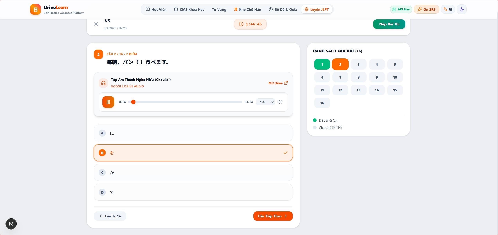
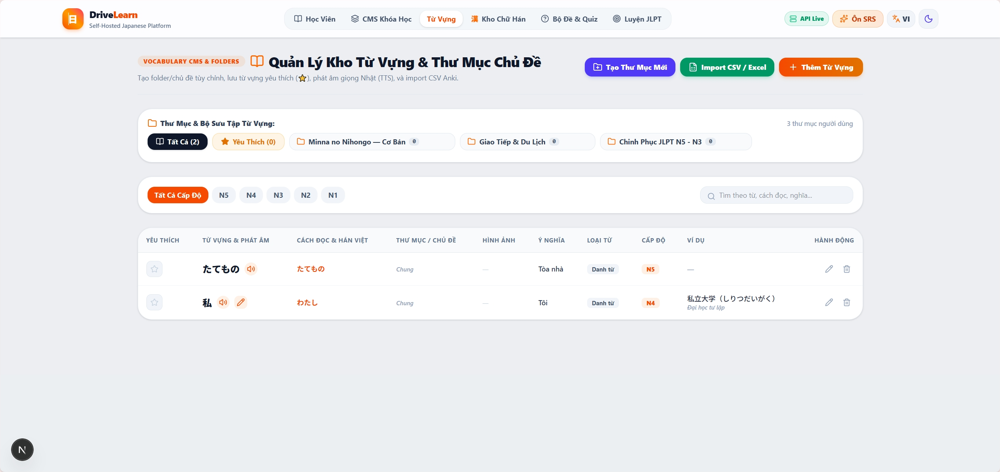

# 🎌 DriveLearn - Nền Tảng Học Tiếng Nhật Toàn Diện

<div align="center">

[](https://dotnet.microsoft.com/)
[](https://nextjs.org/)
[](https://www.typescriptlang.org/)
[](https://www.postgresql.org/)
[](https://tailwindcss.com/)

**Hệ thống LMS tiếng Nhật hiện đại — Tích hợp Google Drive, Luyện viết Kanji, Ôn tập ngắt quãng SM-2 và Thi thử JLPT N5–N1.**

---



</div>

---

## 📚 Giới thiệu

**DriveLearn** là hệ thống quản lý học tập (LMS) mã nguồn mở hiện đại được thiết kế đặc biệt cho việc học và giảng dạy tiếng Nhật (JLPT N5-N1), tích hợp hoàn toàn với **Google Drive** để quản lý tài nguyên học tập (video, audio, PDF) một cách linh hoạt, bảo mật và hiệu quả mà không tốn dung lượng lưu trữ server.

---

## 📸 Hình Ảnh Giao Diện & Trải Nghiệm Thực Tế

### 1. 🎓 Giao Diện Học Tập (Learner Experience)
Phát video bài giảng chất lượng cao, tài liệu đính kèm, danh sách từ vựng & Kanji theo bài học, cùng trình phát âm thanh hỗ trợ luyện nghe Chōkai chuyên sâu.

<p align="center">
  
</p>

### 2. 🛠️ Course Builder CMS & Auto-Suggest
Quản lý cây bài học phân cấp (Khóa học $\rightarrow$ Chặng $\rightarrow$ Bài học), kéo thả tự do, và công cụ **Auto-Suggest** tự động gom nhóm tài nguyên Google Drive thành bài học chỉ với 1 click.

<p align="center">
  
</p>

### 3. ⚡ Đồng Bộ Dữ Liệu Google Drive
Quét cây thư mục Google Drive theo thời gian thực, quản lý phân quyền OAuth 2.0 an toàn và tự động ánh xạ siêu dữ liệu (Metadata).

<p align="center">
  
</p>

### 4. 🀄 Trung Tâm Kanji & Bảng Luyện Viết Tương Tác
Tra cứu Kanji N5–N1, phân tích bộ thủ, âm Hán Việt, On/Kun. Bảng vẽ tương tác Canvas hỗ trợ hiển thị hoạt họa thứ tự nét (KanjiVG) và nhận diện nét vẽ trực tiếp.

<p align="center">
  
  
</p>

### 5. 🧠 Thẻ Ghi Nhớ & Lặp Lại Ngắt Quãng SM-2
Thuật toán SuperMemo SM-2 tự động tính toán chu kỳ lặp lại tối ưu cho từng từ vựng dựa trên mức độ ghi nhớ (*Again, Hard, Good, Easy*).

<p align="center">
  
</p>

### 6. 📝 Hệ Thống Thi Thử JLPT N5–N1 & Làm Bài Tập Tương Tác
Ngân hàng đề thi thử bấm giờ thực tế chuẩn format JLPT, đa dạng dạng câu hỏi (Trắc nghiệm, Điền từ, Nghe hiểu Audio, Sắp xếp từ) kèm phiếu chấm điểm tức thì.

<p align="center">
  
  
</p>

### 7. 📚 Ngân Hàng Quản Lý Từ Vựng (Vocabulary CMS)
Tra cứu, lọc theo cấp độ JLPT, chỉnh sửa nghĩa, phiên âm Hiragana, ví dụ mẫu và phát âm từ vựng bằng công nghệ Speech Synthesis (TTS).

<p align="center">
  
</p>

---

## 🚀 Bắt Đầu Nhanh

### 1. Yêu cầu hệ thống
- **Backend**: .NET 10 / ASP.NET Core
- **Frontend**: Next.js 16 / React 19 / TypeScript
- **Database**: PostgreSQL 16+
- **Storage**: Google Drive API access

### 2. Khởi Chạy 1-Click (Windows)
Chạy file [`start.bat`](start.bat) để tự động khởi động toàn bộ dịch vụ (PostgreSQL + .NET Backend + Next.js Frontend).

### 3. Cài đặt Thủ công
```bash
# 1. Chạy Backend
dotnet ef database update --project src/NihongoLms.Infrastructure --startup-project src/NihongoLms.Api
dotnet run --project src/NihongoLms.Api/NihongoLms.Api.csproj

# 2. Chạy Frontend
cd frontend
npm install
npm run dev
```

* Frontend: `http://localhost:3000`
* Backend API: `http://localhost:5222`
* Swagger UI: `http://localhost:5222/swagger`

---

## 📄 Giấy Phép (License)
Phát hành theo giấy phép mã nguồn mở **MIT License**.
